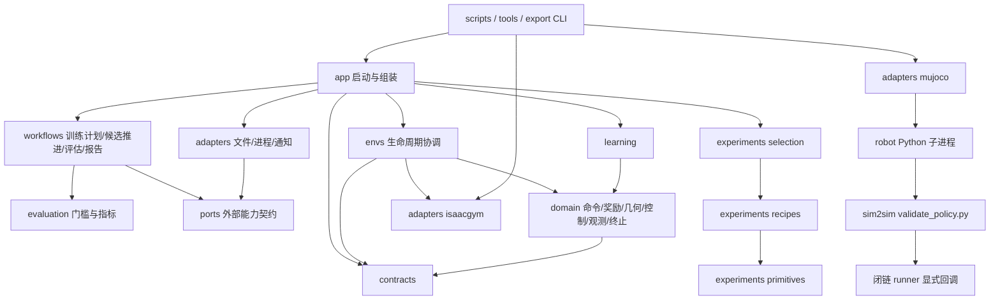

# 架构入口：先读边界，再读目标模块

本文件记录当前源码结构，不依赖聊天记录。重构正在分阶段进行，不能把目标目录已创建
理解为全部迁移完成。机器人训练保持停止，架构验证仅允许必要 smoke。

完整目标的证据和剩余缺口见[验收台账](docs/architecture/completion_audit.md)，不能只凭测试数量判断完成。
剩余监督器的具体文件及处理顺序见[监督器清单](docs/architecture/supervisor_inventory.md)。

## 已落地的模块

| 模块 | 一句话职责 | 公开入口 |
|---|---|---|
| `contracts` | 定义环境配置结构及既有默认值 | `base_config`、`legged_robot_config`、`wheel_legged_config` |
| `experiments` | 用基础配置构建独立实验配方 | `selection.apply_policy_experiment`、`primitives.apply_training_profile` |
| `domain/commands` | 计算命令、课程及跟踪统计 | `resampling.resample`、`command_curriculum`、`tracking_metrics` |
| `domain/rewards` | 通过显式状态输入计算奖励，禁止读取仿真器 | `api.evaluate`、`inputs.RewardInputs` |
| `domain/geometry` | 计算坐标变换与环境原点布局 | `rotations`、`origins.build_origin_layout` |
| `domain/control` | 初始化控制参数并计算六通道混合PD力矩 | `initialization.initialize`、`actuation.mixed_pd_torques` |
| `domain/observations` | 组装25D观测、noise scale及history更新 | `policy.proprioception`、`noise_scale_vector`、`update_history` |
| `learning` | 网络、PPO、存储、训练循环 | `modules.api`、`algorithms.ppo`、`runners.on_policy_runner` |
| `adapters/isaacgym` | 封装Gym资产、actor、共享张量、物理reset及评估加载 | `robot_asset`、`actor_creation`、`asset_indices`、`state_tensors`、`state_reset`、`evaluation_setup`、`policy_io` |
| `adapters/artifacts` | 读写 checkpoint、JIT 导出和实验 manifest | `checkpoints.get_load_path`、`jit_export.export_policy_as_jit`、`experiment_manifest.write_experiment_manifest` |
| `adapters/mujoco` | 通过独立进程调用公开闭链验证 CLI | `api.run_validation` |
| `evaluation` | 对记录数据计算门槛和动态指标 | `gates.gate`、`transitions.summarize`、`sequences.summarize` |
| `workflows` | 协调评估、候选推进、导出和报告，不实现传输 | `motion_evaluation.evaluate`、`motion_round.advance_round`、`policy_export`、`validation_schedule`、`completion` |
| `adapters/notifications` | HAPI/本机消息投递及去重 | `hapi` |
| `adapters/processes` | 运行单个可取消且记录日志的Python子进程 | `python_job.PythonJobRunner.run` |
| `ports` | 声明由应用注入的外部能力 | `processes.PythonJob`、`artifacts.EvaluationArtifacts`、`notifications.NotificationSink` |
| `app` | 解析运行输入并组装环境、工作流和外部能力 | `bootstrap.create_task_registry`、`motion_supervisor.main`、`candidate_closed_review.main` |
| `envs` | 按固定step/reset时序协调计算与仿真 | `base.legged_robot.LeggedRobot` |

依赖箭头指向被依赖方；实际调用方迁移后删除旧包装，不以旧用法兼容为保留理由。



跨进程数据是显式 CLI 参数、ONNX、序列 JSON 和结果 JSON；训练 Python 不导入 MuJoCo。
三个公开进程接口及兼容例外的机器可读清单见
[process_interfaces.json](docs/architecture/process_interfaces.json)，测试阻止训练代码重新导入外部内部模块。
MuJoCo仓库的ARCHITECTURE.md和dependencies.json记录其本地模块边界，并用独立的
tools/check_architecture.py检查；本仓库图不能代替外部仓库审计。
兼容 CLI 在启动边界读取 `FUDAN_SIM2SIM_ROOT`，默认使用同级 `wheel_leg_sim2sim`。
MuJoCo 初始化和逐步测量已经归属于 sim2sim 仓库，未更改求解算法或安全检查。

## 最小阅读路径

- 修改命令采样：读本图、`domain/commands` 目标文件及对应 tests；不要修改 policy 网络。
- 修改命令重采样顺序：读[重采样指南](docs/modules/command_resampling.md)，保留RNG及启停reset时序。
- 修改课程checkpoint：读 [课程持久化边界](docs/modules/course_checkpoint.md)，区分payload计算与环境恢复顺序。
- 修改动作和观测计算：读 [policy接口指南](docs/modules/policy_io.md)，再读control/observations目标函数。
- 修改默认姿态与PD初始随机化：读[控制初始化](docs/modules/control_initialization.md)，保持增益匹配和RNG调用顺序。
- 修改地形创建参数：读 [地形创建指南](docs/modules/terrain_creation.md)，再读Isaac适配器；不改命令课程。
- 修改环境初始位置：读[原点布局](docs/modules/origin_layout.md)，其计算不依赖Gym句柄。
- 修改contact/轮子/几何索引：读[资产索引](docs/modules/asset_indices.md)，区分Gym handle与名称列表序号。
- 修改Gym状态buffer：读 [共享张量所有权](docs/modules/simulation_tensors.md)，避免把共享视图误改成副本。
- 修改环境step/reset顺序：读[生命周期图](docs/modules/environment_lifecycle.md)，区分共享存储、历史状态和method/legacy时序。
- 排查reset原因：读 [终止判定](docs/modules/termination.md)，分开检查fail、timeout、edge与实际reset。
- 修改奖励：读 [奖励模块指南](docs/modules/rewards.md)、`domain/rewards/api.py` 和目标公式；不必读仿真生命周期。
- 修改实验：读 `experiments/selection.py`、目标 recipe 及其引用的 primitives；不要从 recipe 导入 selection。
- 修改motion/height的外部spec或来源校验：读 [实验输入指南](docs/modules/experiment_inputs.md)；文件输入归app，配方接收显式spec。
- 修改 PPO：读 `learning/algorithms/ppo.py`、所用 modules/storage；不读环境 CLI。
- 修改闭链验证入口：读 `adapters/mujoco/api.py` 及 sim2sim 的 `VALIDATION_API.md`。
- 修改验收公式：读 [验收模块指南](docs/modules/evaluation.md)，无需阅读监督器。
- 修改motion候选选择或进程执行：读 [监督器边界](docs/modules/motion_supervisor.md)，分别进入evaluation或processes适配器。
- 修改motion评估恢复：入口为app.motion_resume.restore_evaluation_options，PID检查/文件读取留在app边界。
- 修改闭链候选复核流程：读[候选复核边界](docs/modules/candidate_closed_review.md)，区分门槛、应用进程和报告生成。
- 修改固定高度诊断/嵌套STOP传播：读[诊断进程边界](docs/modules/fixed_height_diagnosis.md)，不混用直接取消与子job协作停止协议。
- 修改高度课程/双高度/补筛流程：读[高度应用入口](docs/modules/height_supervisors.md)，入口不再隐式加载Isaac。
- 查看历史站立/低速监督器：读[显式启动边界](docs/modules/historical_supervisors.md)，导入不启动任务，CLI实际执行仍需训练授权。
- 修改历史站立/低速验收：使用evaluation.stand_continuation或low_speed_relay；文件与进程不进入门槛模块。
- 修改TensorBoard摘要：读[训练日志摘要](docs/modules/training_summary.md)，分开处理event读取和统计计算。
- 修改GUI播放：读[GUI状态边界](docs/modules/play_gui.md)，GUI状态与训练domain分开，先补交互测试再迁移共享状态。
- 修改结束通知：读 [通知模块指南](docs/modules/completion.md)，不需要导入训练算法。
- 排查任务组装：读 `app/bootstrap.py`、`app/task_registry.py`；registry 由调用者创建并持有，导入不会自动注册。
- 迁移旧Python调用方：读[入口迁移表](docs/modules/compatibility.md)，使用责任模块，旧包装和全局自动注册已移除。
- 修改配置转换、CLI或run源码快照：读 [配置与启动指南](docs/modules/configuration.md)，再读对应责任模块。

## 可执行依赖审计

```bash
python tools/check_architecture.py
python tools/check_architecture.py --write docs/architecture/dependencies.json
```

使用标准库 AST；覆盖普通/相对/函数内导入及包初始化。退出码非零表示本地循环依赖。
完整边带源码行号；不会执行 Isaac 或 MuJoCo。第三方内部依赖不属于本仓库审计范围。
missing_local_imports检查wheel_legged_gym绝对/相对导入的目标模块是否存在，包含函数内部。
无__init__.py的namespace package合法；from模块导入的具体属性是否存在仍由运行测试验证。
对已迁移的contracts/domain/experiments/evaluation/learning/ports/workflows/adapters同时执行允许层级检查，
并禁止核心计算/工作流导入Isaac和MuJoCo。导入无环不能证明运行时没有隐式依赖，迁移清单仍需逐项完成。

envs、utils和app也纳入层级约束：envs作为环境协调层可依赖domain/contracts/Isaac适配器，
不得导入app、实验选择或训练器；utils为叶子层，不能导入环境；app负责组装上述层，
不得反向导入scripts。envs→utils已禁止；yaw几何计算归domain.geometry.rotations。
tools、export_onnx与wheel_legged_gym.scripts作为可执行入口，禁止被任何本地模块直接导入，
入口之间也不互相导入。可复用逻辑放入责任模块；跨进程调用仍由显式CLI契约定义。
该规则覆盖函数内部导入；它不能替代对每个旧监督器内部职责的检查。
架构测试还禁止生产模块直接调用eval/exec/__import__；地形生成通过显式函数表选择。
这不是完整动态Python分析，别名调用与第三方内部行为仍需审查，不能据此宣称绝无动态依赖。

## 未完成迁移及兼容边界

1. `envs/base/legged_robot.py` 已将独立计算、控制初始化和原点布局交给domain，资产/actor/索引/随机化/共享张量与物理reset交给Isaac适配器。生命周期与buffer所有权指南已核对；最终仍需代表性运行验收，不能只用静态图宣称等价。
2. `utils/helpers.py`、`utils/task_registry.py`、`utils/terrain.py`转发已删除：配置转换归contracts，CLI/种子/registry归app，仿真/地形归Isaac适配器，checkpoint/JIT归artifacts；只从责任模块导入。
3. 完成hook、验收指标、命令序列、并行调度已迁入正式模块；motion CLI已薄化，参数/状态/进程、训练计划及候选轮次推进边界已拆分。启动恢复与其他tools监督器仍待核对和整理。
   清单中的16个监督器入口已全部归app，tools保留薄CLI；内部进程/artifact协议的核对
   与必要职责提取仍按监督器清单执行，不以入口迁移替代完整验收。
4. 实验目录不再读取环境变量或来源文件；环境输入归app/experiment_inputs，来源校验和checkpoint迁移归artifacts。legacy_sources保留历史证据路径与原门槛，新配方应采用显式spec。
5. mapping audit、closed probe、tree probe均改为公开MuJoCo进程接口；tree/closed测量使用冻结快照回调，已移除这些入口的monkey patch。MuJoCo库直接使用，不修改物理引擎；后续仅在验证接口确有缺口时修改外部runner，不继续全面拆分sim2sim内部。
6. 自有代码静态循环目前为零；包内允许层级及禁止反向导入tools/scripts/export规则已生效。仍须复核动态导入、进程接口和旧监督器内部职责；静态允许边不代表接口粒度已经充分清晰。
7. scripts/play.py的GUI命令状态已收进每次play会话的PlayCommandState；键盘/panel/循环
   通过显式绑定回调访问。无人调用的135D export_encoder_jit.py已归档；当前125D策略ONNX入口不变。
   FUDAN_SCALES奖励表及TERMINAL状态集合已冻结，原值与顺序不变。

这些是过渡任务，不是永久例外。架构 goal 不因本阶段测试通过就完成。

## 等价与成果边界

固定 policy 契约为25D观测、5帧125D history、6D left-first动作。保留已有物理步长、
PD、动作scale、reward、随机数调用顺序、checkpoint键、ONNX接口和验收门槛。
资产、logs、outputs、checkpoints不搬迁。保留的CLI继续可运行；envs/wheel_legged实验转发
已删除，直接使用app/experiments/artifacts责任入口。配置统一使用contracts，学习统一使用learning。

最新模型证据读 `docs/dynamic_start_stop.md`；训练中断模型不等于验收通过模型。
原始实验文件原地保留。架构证据读 `docs/architecture/refactor_progress.md`。
