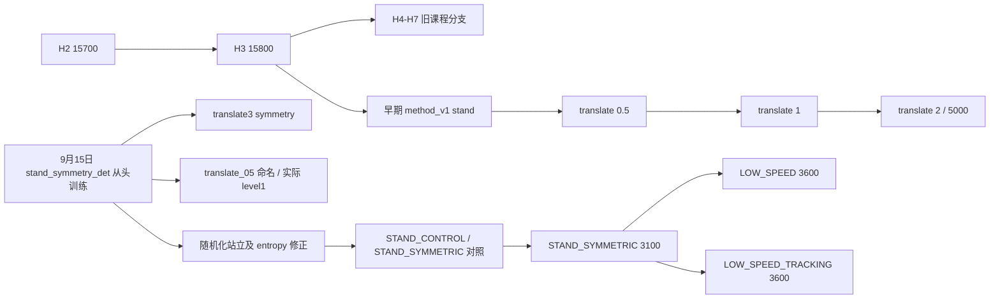

# 模型分支与 checkpoint 索引

更新：2026-09-19。这里的“分支”指模型训练继承关系，不是 Git branch。
当前快照包含 **116 个 run、1038 个 checkpoint**。数量、最大 iteration 只说明文件存在，
不代表训练结束或通过验收。未保存 manifest 的旧 run 不推断训练来源。

## 当前采用的结论

**最新配对分支：** 从同一低速model100完整续训，`ENCODER_FROZEN` / `ENCODER_UPDATING`，
分别为 `Sep19_10-09-43_encoder_ablation_20260919_100936_frozen` 和
`Sep19_10-20-22_encoder_ablation_20260919_100936_updating`，各保存200/300/400/500/600。
冻结组600有516次验收失败重置，更新组600无失败但跟踪不合格；均不替代低速model100。
验收和机制证据见 [encoder配对消融](encoder_ablation.md)。

**最新支线 H3_SPEED1**：从下述已验收model100完整续训，run
`Sep19_09-38-35_h3_speed1_20260919_093828`，保存200/300/400/500/600。
全点检查未找到完整通过0/±0.5/±1的模型，600有低速退化，继续保留源model100。
model200仅作为+1改善/-1不足的诊断对照；见 [±1课程记录](h3_speed1.md)。

**后续进展：H3迁移已完成。** 当前低速候选更新为
`Sep19_09-17-38_h3_low_speed_20260919_091730/model_100.pt`（相对 `plane/logs/wheel_legged/`）。
0/±0.5 三种子9/9通过、ONNX一致性通过，±1未通过。其父为下述H3 15800，
仅迁移actor/encoder/std，重建critic/optimizer；500点也通过低速但停车/高度较差。
详见 [迁移记录](h3_low_speed_migration.md)。以下116 run清单与八候选结论是迁移前快照，
不含本轮新增smoke和训练run，勿将其当成实时总数。

- 历史运动迁移起点：**H3 model_15800.pt**，是此前8个候选中的相对优选，尚未完整过关。
- 站立参考：**STAND_SYMMETRIC model_3100.pt**，保留已验证的零命令/小推扰用途。
- 两条最新 LOW_SPEED 模型作为失败对照保留，不默认继续延长训练，也不覆盖站立基线。
- 本次无模型通过 `0、±0.5、±1 m/s` 的全部独立门槛，未升速至 ±2/±3。
- 保留新评估/诊断框架；后续优先保留旧 H3 的运动权重，再受控调整训练。

完整方法、数值和迁移边界见 [统一验收报告](policy_version_comparison.md)。
README 和早期 HANDOFF 中的高速目标、训练日志“通过”不能替代这次独立验收。

## 本次比较的八个代表模型

以下 checkpoint 路径均相对于 `plane/logs/wheel_legged/`，精确 SHA256 见
[可机读证据](data/policy_comparison_20260919.json)。不要仅凭 `model_3600.pt` 等 basename 选模型。

| 标识 | 分支 / checkpoint | 用途与限制 |
|---|---|---|
| legacy_h3 | `Sep05_17-41-43_H3_from_H2_best_v1/model_15800.pt` | 推荐运动迁移候选；+0.5、-1 跟踪误差超标，不能直接升速 |
| legacy_h7_fixed | `Sep06_16-54-55_H7_fixed_3ms_stable_v1/model_16200.pt` | 旧固定 3 m/s 课程对照；课程名不表示已通过 3 m/s 验收 |
| legacy_h7_bounded | `Sep06_18-52-26_H7_bounded_reward_long_v1/model_17700.pt` | 旧 bounded reward 对照；本次低速跟踪弱于 H3 |
| method_translate2 | `Sep07_16-10-41_method_v1_translate_20_long_v1/model_5000.pt` | 早期重构运动分支；前进跟踪不足，随机化下存在失败 |
| method_translate3_symmetry | `Sep15_22-48-01_method_v1_translate_30_symmetry_v1/model_1500.pt` | 后期站立重训后的运动对照；偏航小但速度响应弱 |
| standing | `Sep18_21-21-37_stand_validated_20260918_212129/model_3100.pt` | 站立参考；±1 m/s 多次失败，不作为已验收运动策略 |
| low_speed | `Sep18_23-25-44_low_speed_05_20260918_232537/model_3600.pt` | 从 standing 追加 500 iteration；停车、后退和前进偏航不合格 |
| low_speed_tracking | `Sep18_23-49-14_low_speed_05_20260918_234907/model_3600.pt` | 同一起点追加 500 iteration，调整 tracking cap；仍未过关 |

H7 的选择是各自 run 内存档 event 的筛选结果；其他候选为有文档依据的代表点。
这不是对全部 1038 个 checkpoint 的性能排名。完整指标保存为
[240 项逐 seed 记录](data/policy_comparison_20260919.csv)。

## 继承关系与版本区别

1. **早期旧课程**：A/B/C/R/L/Y/S/T/H，以及 H2/H3 和后续 H4–H7。
   其中 S/T 的 raw action symmetry 思路已不推荐；旧 run 全部保留。
2. **早期 method_v1 迁移线**：H3 15800 → method_v1 stand → translate 0.5 → 1 → 2。
   重构了 reward/课程，部署 contract 仍为 25D observation、125D history、6D action。
3. **后期站立重训线**：9 月 15 日 `stand_symmetry_det_v1` 的 manifest 为
   `resume=false`；此线没有继承上面的 ±2 运动 checkpoint。
   它分别分出 translate3/translate1 实验，以及随机化站立、STAND_SYMMETRIC、LOW_SPEED。
   名称含 `translate_05_symmetry_v1` 的 run 的 manifest 实际为 `command_level=1`，
   应按 manifest 的 level 解释，不能只根据名字认定是 ±0.5。
4. **站立诊断/消融支线**：STAND_CONTROL / STAND_SYMMETRIC、geometry probes、
   FUDAN_STAND。FUDAN_STAND 的低姿态结果不是有效站立基线，见
   [对应记录](fudan_stand_experiment.md)；弱几何奖励的分支内效果见
   [站立对照](stand_balance_ablation.md)。



图中省略中间 checkpoint；每个 run 的精确父 run、源 iteration、seed、profile、
随机化 level 和现存 checkpoint 序号，以 [全量 run 清单](data/model_runs_20260919.json) 为准。
该清单中的 `null` 表示 manifest 没有该字段，不补造 resume 语义；`-1` 保留原始值。
两个同名编号 3600 是同一个 3100 起点的兄弟实验，不是相互续训。

## 保存方式与后续更新

- Git 保存结论、模型身份/哈希、全量 run 清单和 240 项精简指标，不提交模型二进制。
- 原始 TensorBoard/checkpoint 保持在 `plane/logs/wheel_legged/`；完整仿真 JSON、stdout、
  源码快照保留在 `plane/outputs/policy_comparison_20260919_004138/`。
- `.gitignore` 仍忽略 logs/outputs；文档中的模型路径是本机资产索引，Git clone 不包含权重。
- 新训练建立独立 run，记录父模型、载入方式、实际 reward/optimizer/std、验收结果。
  只有经过同条件验收后才更新“推荐运动起点”，不使用“最新 checkpoint”代替选择依据。
- 清单生成命令（读取本地存档；不训练、不删除文件）：

```bash
/home/kellen/anaconda3/envs/fudan_leg/bin/python tools/export_model_registry.py
```

该命令刷新固定 2026-09-19 快照文件，运行前确认需要更新这份快照；未来独立验收应使用新日期。
它校验 8 个选中 checkpoint 哈希，并从已完成的比较任务复制文本证据。

## 本次 Git 记录范围

```text
README.md
docs/model_branches.md
docs/policy_version_comparison.md
docs/data/model_runs_20260919.json
docs/data/policy_comparison_20260919.json
docs/data/policy_comparison_20260919.csv
tools/export_model_registry.py
tools/compare_policy_versions.py
tools/summarize_policy_comparison.py
plane/wheel_legged_gym/scripts/evaluate_policy_comparison.py
plane/tests/test_policy_comparison_gate.py
```

README 仅更新当前状态入口；提交不混入原先已有的空行改动和其他未提交训练改动。
