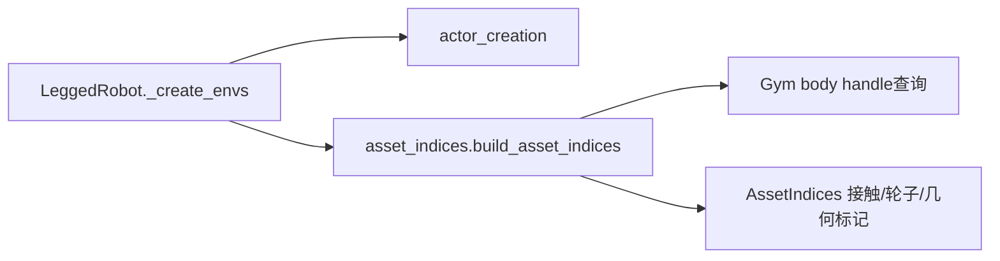

# 资产索引组装

`adapters.isaacgym.asset_indices.build_asset_indices`在actor创建后解析接触与策略标记索引。
输入为Gym句柄、首个env/actor、DOF/body名称、三组接触名称、奖励/命令配置、设备，
以及已有bilateral索引的显式存在标记和值。返回AssetIndices，由环境逐字段接收。

feet/penalised/termination的常规索引来自Gym body handle查询，不可用名称列表序号替换。
normalized_v1分支则校验六个DOF和两轮名称，再按名称序号构造wheel索引，并clone覆盖feet。
查询顺序仍为feet→policy检查/标记→penalised→termination；缺失资产的异常不被吞掉。
接触配置的重复名称不会去重，以保留原计算语义。
legacy模式未启用几何/站立时不增加可选环境属性；已有bilateral索引按原条件保留。

`test_asset_indices.py`覆盖64组method/geometry/stand/已有索引/缺失名称组合，
与冻结旧实现比较结果、错误文本和查询顺序，另检查feet与wheel的存储不共享。
实际smoke证据见`plane/outputs/architecture_refactor_20260923/asset_indices_smoke_equivalence.json`。
