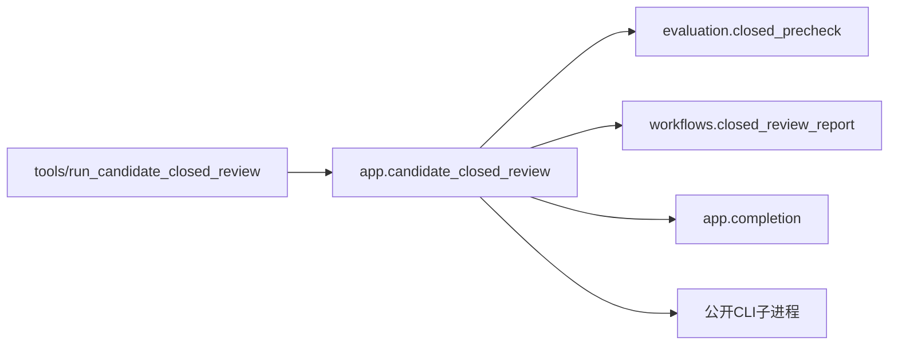

# 候选闭链复核入口

`tools/run_candidate_closed_review.py`只定位仓库并调用
`app.candidate_closed_review.main(root, argv=None)`。应用负责CLI、lock、job状态文件、
子进程、STOP传播与完成通知；默认policy路径和所有子命令保持原值。

`evaluation.closed_precheck.yaw_precheck_passed`只判断policy hash和原门槛：
34000 completed steps、20000样本、vx/yaw/height MAE分别不超过.05/.1/.03，且result.passed。
hash不符仍抛异常，数值不达标返回False。预检失败记录paused_on_regression，不执行后续
steady/dynamic复核。成功预检只是继续流程，不代表接受模型。

`workflows.closed_review_report.render_candidate_review`只生成Markdown，不读写文件或通知。
应用保留finally中save→通用报告→专用报告覆盖→可选wake的原顺序。
当前进程监督仍归应用：发现子job后STOP通过文件传播，发现前直接terminate；wait没有新增
timeout，轮询仍为2秒。本轮不借迁移修改进程协议。未来如需统一进程适配器，必须覆盖这些差异。

测试`test_closed_precheck.py`覆盖每个数值拒绝分支、hash错误和应用预检回归路径，
以假子进程验证仅调用一次、PID清空、终态报告落盘且不触发真实通知。
真实MuJoCo能力以具体run结果为准，测试不作模型运动能力证明。
