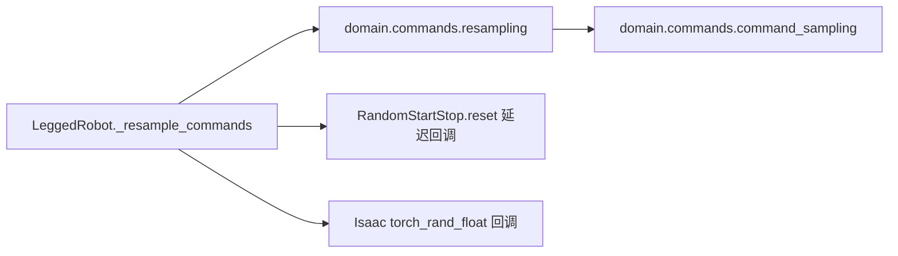

# 命令重采样边界

公开入口为`domain.commands.resampling.resample`，只修改CommandBuffers中的选定行。
`commands`保存命令，`sample_mode`保存诊断类别，`segment_counter`决定轮换bank槽位。
范围、commands配置和设备均显式传入；模块不访问环境实例或仿真器。

顺序必须保持：采样水平命令→更新类别/段计数→随机高度→可选启停reset→height_bank高度覆盖
→可选heading随机采样。height_bank也保留被覆盖的高度随机抽样，否则后续随机序列会变化。
启停scheduler不能提前创建；应用回调仍在原reset位置获取它。
设备保持环境传入的字符串，Isaac TorchScript采样函数不接受torch.device对象。

环境负责决定哪些env需要重采样；domain负责采样与buffer更新。
测试`test_command_resampling.py`对照冻结的原环境方法，覆盖五种策略、heading及启停组合、
非选中行、随机数状态、reset时刻的buffer以及未知策略拒绝。
真实64环境/seed11/1iteration smoke证据见
`plane/outputs/architecture_refactor_20260923/resampling_smoke_equivalence.json`。

2026-09-25 的 `turn_envelope` 是单独授权的行为变更：`env_id%4==0` 的
转弯 cohort 使用 `domain/commands/turn_envelope.py` 开放命令调度，其他
75% 环境仍用原 `basic_motion` bank。其 callback 只在该策略执行；旧五种
策略的重采样顺序不变。验证和命令表见 `docs/modules/turn_envelope.md`。

`TURN_LEAN_LONG` 复用相同 cohort 调度，按显式spec配置转弯占比、速度/yaw
斜坡、随机进入/保持时长；仅转弯cohort在yaw进入/退出期间将公开高度命令
从0.40平滑下发到目标并升回0.40。旧 `TURN_ENVELOPE` 默认0.40不变。
入口及运行状态见 `docs/modules/turn_lean_long.md`。

`cornering_height_skill_v1` 是另一项明确授权的训练行为变更：20-slot 静态 cohort
在 domain 中分配，奇数槽为保留任务，偶数槽分高度技能、低中负荷和高负荷；
`height_skill.py` 与 `turn_envelope.py` 各自只更新所属命令行。
旧策略的 RNG 顺序和采样分支不改。分配和公开高度回高行为由
`plane/tests/test_turn_lean_long.py` 定向验证。
