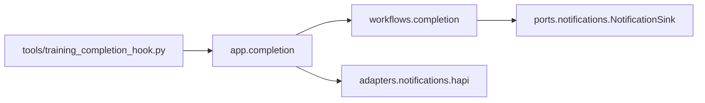

# 终态报告与通知

一句话职责：任务结束后生成一次报告，按显式目标通知一次；绝不决定模型成功或启动下一轮训练。

公开入口：应用调用`app.completion.write_report/wake_session/acknowledge_review`。
工作流的`write_report(job, state, notify)`要求显式提供通知函数，不自行导入HAPI。
HAPI适配器负责发送锁、event ID、复盘确认、超时及本机notify-send；不知道PPO或模型门槛。
未指定HAPI session不能推测另一个聊天作为收件人。

结果文件协议保持不变：`completion_report.md`、`completion_context.json`、
`completion_hook.json`、`hapi_notification.json`、`completion_review.json`。
发送失败/超时不得盲目重发；已复盘事件不再次分析。旧CLI参数与独立Codex复盘模式保留。
本重构测试不实际发送消息，测试通过注入fake通知或替换transport的subprocess调用验证。

验证：`PYTHONPATH=plane python -m pytest plane/tests/test_completion_report.py -q`。
定位重复提醒先读notification/ack文件；不要把goal自动续跑与HAPI通知误认为同一机制。
