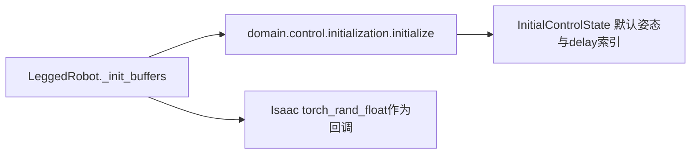

# 控制参数初始化

`domain.control.initialization.initialize`负责默认DOF姿态、PD增益匹配和初始随机化。
输入为DOF数量/名称、默认角度、control/domain_rand配置、physics dt、设备、已有增益/
torque scale/delay buffer，以及随机采样和提示回调。它不读取环境实例、文件或环境变量。

增益与torque scale原地更新，默认姿态以InitialControlState返回。
delay未随机化时返回原buffer，随机化时按原逻辑round/squeeze/long生成新buffer。
DOF分配数量num_dof和名称循环数量num_dofs分开传入，保持原代码语义。

匹配增益时遍历所有stiffness键，多个子串匹配时最后一项覆盖前项；不得改为首次匹配。
没有匹配的关节gain归零，P/V控制仍通过report回调输出原提示。
随机化抽样顺序固定为Kp→Kd→torque scale→默认位置→动作延迟；仅开关启用时抽样。
设备使用原字符串，采样仍由Isaac torch_rand_float执行，不替换随机数实现。

测试`test_control_initialization.py`对照冻结旧实现，覆盖全部32种开关组合、
多重匹配、未匹配提示、采样顺序、RNG状态以及delay buffer身份。
真实64env/seed11/1iteration的对照结果见
`plane/outputs/architecture_refactor_20260923/control_init_smoke_equivalence.json`。
