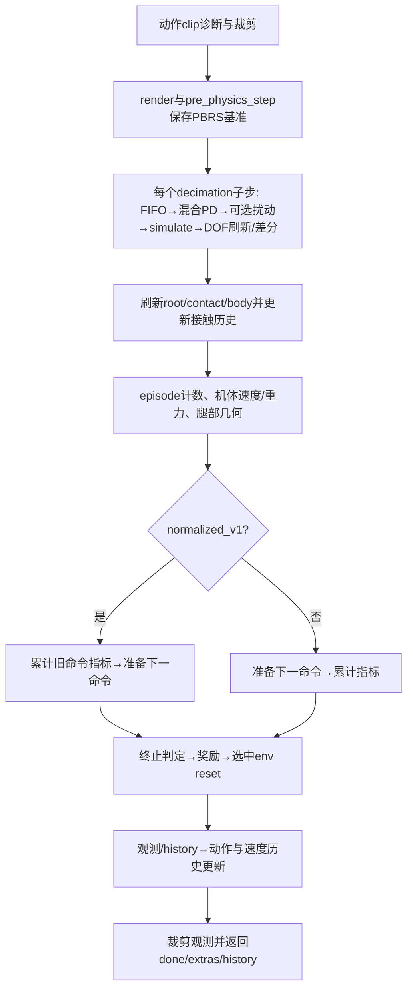

# 环境生命周期与状态所有权

入口是`envs/base/legged_robot.LeggedRobot`，负责把domain计算和Isaac适配器按时序组装。
它不是奖励/课程公式的所有者。修改一个计算模块时无需阅读整个环境类；修改step/reset
顺序时必须读本页以及对应方法，不能把调用顺序当成可随意调整的实现细节。

## 初始化

1. `_parse_cfg`计算policy dt、配置字典及episode长度。
2. `BaseTask.__init__`调用环境的`create_sim`，建立地形、资产、actor与公共任务buffer。
3. `_init_buffers`取得Gym共享张量，再分配动作、命令、接触、延迟及历史状态。
4. 初始化命令范围后建立课程状态；初始化DOF默认姿态与增益后依次抽取随机化参数。
5. 设置`_method_v1`，准备奖励配置，最后设置`init_done=True`。

构造环境不等于执行episode reset。`BaseTask.reset`调用所有环境的`reset_idx`，随后
通过零动作step产生返回观测。不能提前使用尚未初始化的奖励/命令状态。

| 状态组 | 所有者与写入边界 |
|---|---|
| root/DOF/contact/rigid_body存储 | Gym拥有，state_tensors适配器取得共享视图；物理reset经适配器提交 |
| action FIFO、动作历史、速度/位置历史 | 单个环境实例拥有，step更新，reset仅清理原实现规定的字段 |
| command_metrics的25个累计量 | 单个CommandMetrics持有，tracking_metrics累计/汇总，reset最后清零 |
| 命令、范围、段计数、启停scheduler | 环境持有；resampling和课程模块计算；scheduler保持首次使用时创建 |
| 接触历史、seen与终止streak | 环境持有；post-step采集接触，termination计算，method reset清零 |
| 默认DOF姿态、PD gain、torque scale、delay index | 初始化阶段创建并随机化，控制计算读取；不是每次episode重新抽取 |
| 奖励累计、extras、episode长度与done | 环境协调奖励、日志及reset；done在reset后仍为1以向学习器报告终止 |

共享视图和副本细节见[仿真张量](simulation_tensors.md)。历史buffer不是全部在reset清零：
例如action_fifo不在`reset_idx`内清空，本轮不擅自改变这一历史行为。
启用`dof_vel_use_pos_diff`时，`dof_vel`会改用有限差分结果，不能假定它始终是Gym视图。

## 一次policy step

`_post_physics_step_callback`的顺序是周期重采样（除非hold）、启停advance、高度切换、
heading误差转yaw命令、地形高度测量。method与legacy的指标归属时序不同，不能合并。
接触history的重叠切片复制保留clone，避免单环境播放时aliasing错误。

## reset时序

空env_ids直接返回。非空时依次：

1. 汇总旧episode命令指标，累计课程窗口，按现有条件推进地形/命令课程。
2. 重置DOF和root，随后重采样命令。
3. 清理指定历史、episode/失败状态及method接触状态；设置done=1。
4. 用当前proprioception重复填充五帧history。
5. 写episode奖励、命令指标、采样比例、课程指标及可选timeout信息。
6. 更新奖励用位置历史，最后清零选中行command_metrics。

日志中的sample_*比例读取的是重采样后的mode；命令跟踪均值来自reset前快照。
该既有区别已显式记录，架构重构不顺便更改统计定义。`post_physics_step`随后还会调用
compute_observations并更新动作历史，因此不能把reset返回状态直接等同于step返回状态。

## 验证范围与剩余边界

现有测试覆盖PD/观测、终止、重采样、指标、物理reset、共享张量及actor/随机化；
真实1iteration smoke验证该配置下checkpoint和optimizer精确相同。证据索引为
`docs/architecture/refactor_progress.md`阶段70/71。它们不证明所有配置组合的生命周期等价。

step/post-step/reset的跨模块调度留在环境协调层，避免用mixin或动态注入隐藏顺序。
默认DOF/PD增益与随机化已归[control.initialization](control_initialization.md)。
地形初始位置已归[domain.geometry.origins](origin_layout.md)。
资产索引组装已归[asset_indices适配器](asset_indices.md)。环境负责按创建顺序连接
资产、actor、索引和buffer；剩余工作是最终入口与代表性运行验收，不以缩短文件为验收条件。
