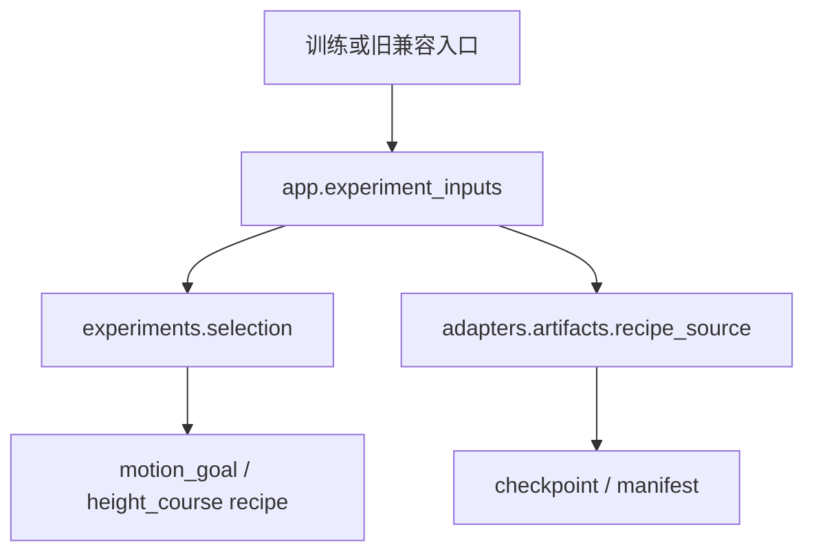

# 实验输入与来源校验

Motion/height配方的公开入口是
`experiments.selection.apply_policy_experiment(cfg, name, train, spec=...)`。
spec是明确的字典输入；具体字段及拒绝条件见目标recipe。配方不读取环境变量或文件。

`app.experiment_inputs`是旧调用方式的应用边界：读取FUDAN_MOTION_GOAL_SPEC或
FUDAN_HEIGHT_SPEC指向的JSON，再调用显式配方。旧envs/wheel_legged模块保留这些入口。
应用边界继续在apply与validate时分别读取文件，保留旧调用时序；本次没有引入缓存。

`motion_goal.validate_spec`验证focus是否在stage命令范围内。应用读入时与显式recipe
调用时均保证校验；它不改变输入。高度配方的阶段、reward gain和切换限制保持原样。

`adapters.artifacts.recipe_source`拥有checkpoint路径/SHA/来源manifest读取；其
`validate_motion_source`与`validate_height_source`显式接收spec，不决定使用哪个实验。
原有reward匹配、full resume及来源profile限制不变。

测试：`plane/tests/test_experiment_inputs.py`覆盖无有效环境路径时的显式配置、旧入口
等价、非法focus及训练resume分支导入。备份源码对照证据见
`plane/outputs/architecture_refactor_20260923/recipe_equivalence.json`。

Stand随机化通过`stand_randomization_level`显式传给selection、primitives或stand_balance。
应用入口才读取FUDAN_STAND_RANDOMIZATION_LEVEL；旧policy_experiments/stand_balance
包装与评估CLI经过应用入口保持兼容。非stand阶段仍忽略该值，stand阶段仍按旧规则转int
并校验0～3。没有传入override时保留配方默认值。

实验目录已不读取环境变量或来源文件；测试对这些边界做静态检查，依赖规则禁止
experiments导入app/adapters/learning。

新 `TURN_ENVELOPE` 由 app 读取显式 `FUDAN_TURN_SPEC` JSON，recipe 只接收
字典，artifact 负责精确 R10200 路径/SHA/reward 来源验证；不能用旧
`--turn-curriculum` 的 6900 起点替代。schema、运行命令和证据入口见
`docs/modules/turn_envelope.md` 及本轮输出目录 `README.md`。

历史来源门槛集中在`adapters/artifacts/legacy_sources.py`，每个`validate_<recipe>_source`
保留各自的证据文件、profile、SHA、reward和resume模式检查，不能用宽松通用门槛替代。
这些历史证据仍定位于仓库docs/data，路径深度已核对；未来增加新来源时应使用显式spec
方案，不在该历史模块增加隐式路径。

`adapters/artifacts/checkpoint_migration.py`负责`verify_full_resume`和
`verify_and_restore_std`：读取checkpoint并核对/恢复既有迁移语义。配方不访问runner。
旧envs兼容模块继续导出原函数名，训练入口直接导入artifact责任模块。

## 只读定义表

experiments/definitions.py保存EXPERIMENTS、METHOD_V1_PHASES和基础reward scale。
嵌套映射只读，tuple/标量保持原类型和值；primitives只读取定义，不维护可变全局注册表。
copy_definition为单次manifest生成独立字典，因此JSON序列化和调用者修改仍可用，
修改某次manifest的optimizer不会再污染后续实验。禁止对定义表原地打补丁；新实验通过
配方或显式输入定义。test_experiment_definitions.py覆盖只读保护和跨实验隔离。
