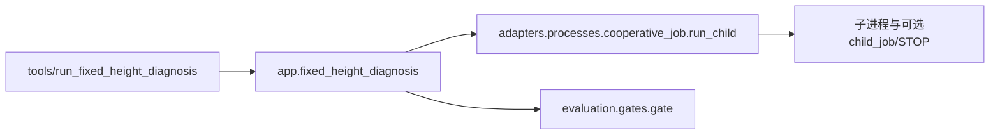

# 固定高度诊断与嵌套任务进程

`tools/run_fixed_height_diagnosis.py`调用`app.fixed_height_diagnosis.main(root)`。
应用按原顺序执行fixed35/fixed45两个完整实验，再筛选7000/7100/7200/7300候选。
每个候选按19/37/53种子顺序验收，遇到失败停止该候选；不因第一个高度失败跳过第二个实验。
来源、命令、阈值与状态标签不变，历史诊断入口不是当前训练授权。

run_child显式接收解释器、root/job、环境、可选child_job和preparing/started/finished回调。
回调仅由应用更新operation/PID并保存，适配器不写状态JSON或决定训练内容。

它与PythonJobRunner的取消协议有意不同：启动前STOP报错；运行中若child_job存在，
写其STOP，否则terminate；退出后若父STOP存在仍报InterruptedError。
异常清理继续使用同样的停止路径并wait，最后finished。on_started仍位于try之前；
本次不改变已有回调失败语义，也不增加timeout。不能用布尔模式堆叠到一个含糊的通用runner。

test_cooperative_job覆盖正常/非零退出、启动前STOP、直接停止、嵌套STOP、轮询异常与spawn失败，
检查命令字面值、回调顺序和进程回收；使用假子进程，不运行历史训练。
