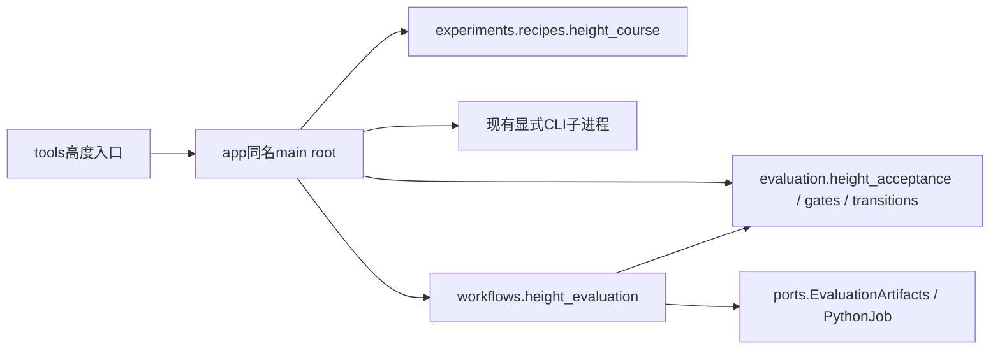

# 高度实验应用入口

tools中的run_height_course、run_dual_height和screen_height_checkpoints只负责CLI路径
引导，应用入口为app下同名模块的`main(root)`。导入不创建任务、不解析参数、不读日志。
前两处旧监督器导入Isaac只为历史配方间接依赖，当前配方已独立，因此删除无用的Isaac导入。
实际训练/评估仍由fudan_leg子进程执行；robot环境能查看height_course的--help，不代表能训练。

run_height_course负责spec→smoke→500iteration→三seed全bank验收→导出/核验→升阶。
run_dual_height先执行dual课程；稳态失败立即终止，成功才验收双向高度切换。
screen_height_checkpoints按原round/iteration/seed顺序补筛micro模型，单seed失败提前结束
该候选；135条记录要求与高度均值统计不变。

本轮只迁移应用所有权并消除多余仿真导入；进程轮询/STOP与artifact仍在应用内部，
须按supervisor_inventory继续核对，不能据此宣布整个高度工作流拆分完成。
test_height_supervisor_entrypoints与提交c5bcfcb中的原main主体逐节点AST对照（冻结fixture），
仅排除新增的root/plane初始化；另验证导入无任务I/O。两个无argparse的入口不执行--help。

高度课程三seed验收现归`workflows.height_evaluation.evaluate_height_checkpoint`。
输入candidate、stage、调用方已排序去重的bank，以及evaluation_script、files/run两个端口。
工作流不构造配方、不导出或接受模型；先按19/37/53执行所有命令，再写原acceptance JSON。
失败的验收行不会跳过后续seed；进程/JSON异常立即传播且不写最终acceptance。
空结果沿用旧all([])语义，未以重构改变门槛。应用仍拥有STOP、日志、候选接受和升阶。
test_height_evaluation对照冻结原应用片段，比较成功/失败行/空结果/进程异常/坏JSON的
全部命令、调用顺序、结果与序列化字节；入口AST测试只展开这段已独立验证的工作流。

双姿态切换的最终判断归`evaluation.height_acceptance.assess_height_transitions`，
返回独立的steady/response布尔值。高度MAE<=.015、非轮接触==0、全部环境settled且
最慢响应<=3秒的原规则保持；NaN仍被<=拒绝，不能直接复用课程中>才拒绝的判断。
空记录/空响应仍保留all([])历史语义，样本完整性不能只靠这两个布尔值证明。
test_height_transition_acceptance对照冻结原判断，覆盖精确边界、None、NaN和未稳定环境。
