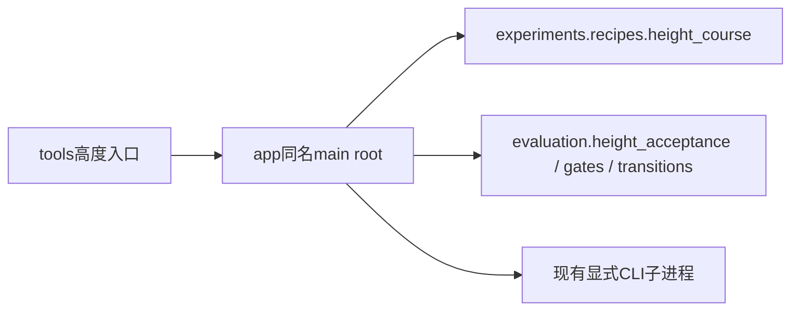

# 高度实验应用入口

tools中的run_height_course、run_dual_height和screen_height_checkpoints只负责CLI路径
引导，应用入口为app下同名模块的`main(root)`。导入不创建任务、不解析参数、不读日志。
前两处旧监督器导入Isaac只为历史配方间接依赖，当前配方已独立，因此删除无用的Isaac导入。
实际训练/评估仍由fudan_leg子进程执行；robot环境能查看height_course的--help，不代表能训练。

run_height_course负责spec→smoke→500iteration→三seed全bank验收→导出/核验→升阶。
run_dual_height先执行dual课程；稳态失败立即终止，成功才验收双向高度切换。
screen_height_checkpoints按原round/iteration/seed顺序补筛micro模型，单seed失败提前结束
该候选；135条记录要求与高度均值统计不变。

本轮只迁移应用所有权并消除多余仿真导入；进程轮询/STOP与artifact仍在应用内部，
须按supervisor_inventory继续核对，不能据此宣布整个高度工作流拆分完成。
test_height_supervisor_entrypoints与提交c5bcfcb中的原main主体逐节点AST对照（冻结fixture），
仅排除新增的root/plane初始化；另验证导入无任务I/O。两个无argparse的入口不执行--help。
