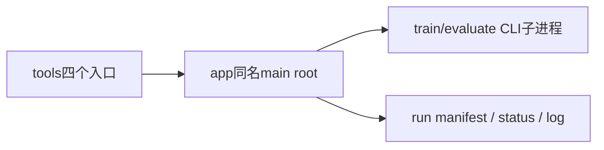

# 历史实验监督器的显式启动边界

以下脚本过去在模块顶层解析参数、读写任务文件和启动子进程。现在tools仅为CLI，
实现位于app同名模块，公开入口统一为`main(root)`；导入不会触发任务。

| CLI / app模块名 | 职责 |
|---|---|
| audit_stand_push | 对固定历史source/candidate执行三seed冲击审计 |
| continue_stand_validated | 检查指定已完成审计，再执行一次历史站立续训 |
| run_low_speed | 执行一次历史低速续训和固定速度审计 |
| stand_long_guard | 等待既有分段任务，检查漂移后决定是否续段 |

这里的历史checkpoint和迭代数是既有实验协议，不是当前推荐模型或启动授权。
本轮只改变执行作用域和root输入，不修改命令、门槛、异常、等待或通知行为。
app持有每次调用独立的state、环境变量映射和save/run闭包，已无模块级可变任务状态。
进程协议仍有进一步归入adapters的空间，不能因移入app就宣称全部
监督器整理完成。continue_stand_validated的watcher调用仍使用completion.main已声明的
--job/--codex参数，现场已核对匹配；本次未实际启动watcher或发送通知。

`test_supervisor_entrypoints.py`以迁移前冻结代码对照main函数体AST，只排除root路径
注入；另在禁止参数解析、目录创建、文件读写和Popen的环境中验证导入无任务副作用。
run_low_speed、continue_stand_validated、stand_long_guard的`--help`可安全检查。
audit_stand_push原无argparse，不能把`--help`当成安全探测命令。

## 独立验收入口

`evaluation.stand_continuation.assess_segment`接收已解析的三seed审计、基线审计、
当前/基线静止结果，返回有序拒绝原因与漂移值。检查顺序仍为seed完整性→每个seed姿态/
接触/失败→160次恢复与2秒边界→knee/wheel几何→静止稳定性→漂移。不会读文件或决定续训。
`evaluation.low_speed_relay.low_speed_passed`只接收报告列表，保留零速.05、非零速.10的
速度MAE上限、.99接触、严格小于.03高度误差等旧门槛。空列表仍沿用all([])=True，
不在本轮悄悄改变历史行为；应用正常流程生成全部9项审计，独立使用者须检查样本完整性。

依赖为app.stand_long_guard/run_low_speed→evaluation对应门槛；evaluation不依赖app。
test_stand_continuation与test_low_speed_relay从未修改的旧主体fixture提取原判断进行
对照，包含阈值相等/超出、失败、缺失/重复seed及多重拒绝原因，验证不修改输入。
入口AST对照只归一化这两处已独立验证的门槛调用，其他进程/持久化主体继续精确比较。
