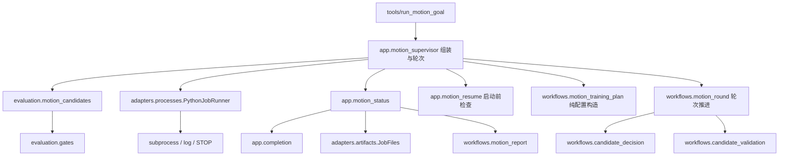

# Motion监督器的决策与进程边界

`tools/run_motion_goal.py`是兼容CLI，向`app/motion_supervisor.main(root)`显式传入仓库根。
应用入口组装实验轮次，参数定义位于`app/motion_options.build_parser`。
读取具体职责时从以下入口开始：

| 模块 | 职责 | 公开入口 |
|---|---|---|
| evaluation/motion_candidates | 判断安全、跟踪评分、姿态保留 | assess、geometry_retained |
| adapters/processes/python_job | 管理单个Python子进程及日志/STOP清理 | PythonJobRunner.run |
| app/completion | 组装报告和通知 | write_report、wake_session |
| app/motion_status | 按原顺序协调状态、报告和唤醒 | save_motion_status |
| app/motion_resume | 读取恢复journal、验证边界/PID、还原运行选项 | restore_evaluation_options |
| adapters/artifacts/job_files | 持久化job文件，不解释状态 | JobFiles |
| workflows/motion_report | 生成progress文本，无外部副作用 | render_progress |
| workflows/motion_evaluation | 协调seed评估、缓存校验和结果汇总 | evaluate、EvaluationOptions |
| workflows/policy_export | 依次导出并数值核验ONNX | export_verified_policy |
| workflows/candidate_screening | 单seed筛查后对前两名做三seed验证 | screen_candidates |
| workflows/candidate_validation | 对筛选候选执行启停/切换附加门槛 | validate_candidate_transitions |
| workflows/candidate_decision | 区分通过验收与分数改善，构造恢复采样focus | decide_candidate、recovery_focus |
| workflows/motion_training_plan | 生成实验spec、去重签名和恢复训练参数 | TrainingOptions、experiment_spec、experiment_signature、training_arguments |
| workflows/motion_round | 根据候选验收推进source、升阶和停滞计数 | advance_round、RoundProgress、RoundMode |

评分公式、候选geometry容差及最终门槛没有变化。适配器不选择checkpoint，不读写
status.json，也不发送通知。工作目录、解释器、环境变量、job目录与三个回调均由应用显式注入。

进程回调顺序保留旧行为：先检查STOP；on_preparing更新operation/command；打开日志
并Popen后on_started记录PID并保存；退出或运行中取消后on_finished清空PID并保存。
spawn失败只记录尝试，不生成虚假的finished事件。轮询仍为2秒，取消仍为terminate+wait。

已知旧语义边界：on_started抛异常发生在finally范围之外，terminate后wait没有超时。
本次仅迁移所有权，没有偷偷调整这些失败路径。后续若强化故障恢复，应独立修改并测试。
回调不能随意引入新的可失败操作。

测试`test_python_job_runner.py`使用短Python进程验证成功、非零退出、预先STOP、
spawn失败、运行中STOP及进程回收。它不会启动训练。监督器`--help`可在无Isaac的robot
环境运行，但真实训练子进程仍必须使用fudan_leg解释器。

保存顺序：status.tmp写入并replace为status.json → completion报告 → 终态且有session时
尝试wake → progress.md。wake失败写hapi_hook_error.txt并继续；报告失败直接传播。
环境映射由应用传入，保留每次save时读取session的时机。测试不发送真实通知。

评估工作流显式接收stage_commands、EvaluationOptions、recovery_geometry、evaluation_script、
files、run和digest。files提供directory/exists/read_json/write_json，run执行CLI；
workflow不导入app或adapter。已有输出先检查checkpoint SHA；不会因为缓存存在就认定有效。
recovery_geometry由app持有并更新，workflow只读。稳态和动态结果/response文件格式保留。

processes.PythonJob与artifacts.EvaluationArtifacts在ports声明实际依赖；工作流不依赖
具体PythonJobRunner或JobFiles。导出工作流先执行export_onnx，再以batch256运行verify_onnx，
两步都成功才返回路径；失败原样传播。返回路径不代表运动能力验收通过。

candidate_screening只负责一轮内+100到+500的5个checkpoint筛选，先seed19，按原tuple
排序取前两名，再用19/37/53验收；两次均要求safe且没有posture_retained=false。
平分沿用路径排序，不改成最新模型优先。返回候选列表不代表最终接受：动态验收、升阶与
source更新仍由应用协调。测试覆盖筛查顺序、平分、第二轮安全拒绝、空候选和异常传播。

candidate_validation按原顺序原地补充result：启停验证启用时总会执行，passed与原静态结果
取AND；switches只在此前门槛通过后执行。工作流不导出模型、不更新source、不修改score。
失败异常直接传播；16种门槛组合及异常测试覆盖该顺序。

candidate_decision只返回决策值，不写入source或accepted。分数改善仍严格要求小于
baseline减0.01，等于边界不算改善；passed可独立于分数改善成立。应用仍先成功导出，
再记录accepted、推进stage，保证导出失败不能提前接受候选。focus保留失败命令顺序，
重复数仍为min(4,stagnant+2)，不删除原stage anchor。

轮次推进归motion_round，显式接收进度、模式、状态journal及evaluate/export回调。
导出失败时accepted/history不能改变；升阶评估失败时已导出的accepted仍保留，
由应用捕获异常并保存。最终课程通过只返回curriculum_finished，保留原pending验证状态，
不设置goal_complete。状态持久化、停滞上限、训练启动和恢复边界仍归应用。
test_motion_round覆盖空候选、拒绝/改善、恢复模式focus、动态拒绝、升阶、最终状态及失败顺序。
剩余工作是监督器启动/恢复及artifact边界的最终核对，以及其他tools监督器整理。

恢复检查现集中于app.motion_resume：读取status→确认evaluating或符合原STOP评估模式→
仅STOP恢复分支检查source_iteration+500 checkpoint→按supervisor/child顺序探测PID→
还原limits（排除resume_evaluation_job）。错误文本、顺序和原evaluating分支不额外检查
checkpoint的行为保留。PermissionError直接传播，不能当作进程已死。
此入口不移除STOP、不加锁、不写状态、不启动进程；这些操作仍在主应用后续原位置。
test_motion_resume覆盖恢复、错误边界、缺失checkpoint、存活PID和权限错误共10项。

训练计划不接收argparse Namespace，只接收冻结的TrainingOptions及显式source/hash/stage/focus。
应用负责验证CLI组合、读取checkpoint哈希、持久化spec和启动子进程。默认字段继续省略，
start_stop_fraction=0必须写入，不能因为是假值而误变成默认动态训练比例。
重复实验签名仍为spec与seed的排序JSON；focus重复项及顺序不变。
smoke/正式轮次的80/4096环境数和1/500 iteration仍由应用按原顺序追加，未启动训练。
test_motion_training_plan对照提取前冻结逻辑，验证36组配置序列化和签名一致。
