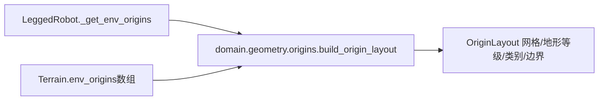

# 环境原点布局

`domain.geometry.origins.build_origin_layout`从环境数量、设备、terrain配置、spacing和
可选terrain原点数组生成OriginLayout。无Gym句柄、文件读取或环境实例依赖。

环境显式接收布局字段。plane/None等普通分支仅设置custom_origins、env_origins、flat_idx，
其他结果为None且不在环境中新增属性。rough分支保留原torch.randint调用、地形类别分桶
及basic/advanced索引拼接顺序；curriculum关闭时使用全部terrain rows作为初始等级范围。

兼容的是计算语义：原有地形类别边界仍为4/8/12/14/18/20，y上界仍使用terrain_length，
平面网格仍使用原meshgrid默认索引。不能把看似更通用的公式修改混入本轮重构。
`test_origin_layout.py`对照冻结旧方法，覆盖plane/None/heightfield/trimesh、课程开关及
1/7/43个环境，逐项检查坐标、索引、边界、dtype与RNG状态，共24组。
