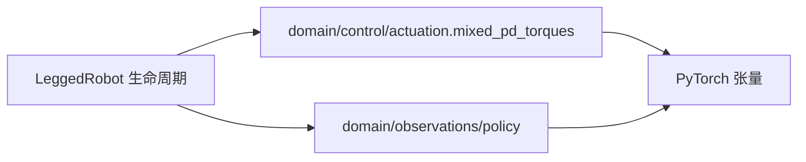

# 动作与观测：最小阅读路径

训练环境通过两个纯计算模块实现固定的部署接口：

`mixed_pd_torques` 接收显式 gains、当前位置/速度、默认位置、action scale 和 torque scale，
输出未裁剪的力矩。腿通道0/1/3/4采用position target，轮通道2/5采用velocity target。
环境负责先统计preclip saturation，再按torque limits裁剪；顺序不能颠倒。

`proprioception` 只组装25D干净观测：angular velocity 3、gravity 3、commands 3、
leg position 4、joint velocity 6、previous action 6。`noise_scale_vector`只生成幅值，
不抽取随机数。环境先构建privileged observation，再给actor observation加noise。
这两者不能交换，否则critic看到的数据会改变。

`update_history`显式原地更新调用者的history，保留oldest→newest及既有更新时刻。
环境继续持有history和所有仿真张量；domain不持有全局buffer、不导入仿真器。
Privileged observation由`domain/observations/critic.privileged_observation`组装，
显式接收质量、COM、摩擦等训练侧输入；它不是部署输入。batch内mass均值、height clip、
通道顺序保留原实现。环境仍决定何时组装critic、何时给actor加噪声。

兼容方法`_compute_torques`、`compute_proprioception_observations`、
`_get_noise_scale_vec`保留。既有noise height slice 48:235在25D输入上为空，
本次保留旧行为，不能把历史遗留语义调整混入架构重构。

## 验证

`plane/tests/test_control_observation_equivalence.py`从实际环境源码提取这些方法执行，
与`fixtures/control_observation_reference.py`中冻结的迁移前方法对照。无需Isaac Gym；
覆盖16组seed/method/noise/privileged组合，检查全部状态张量及RNG状态精确相等。
冻结reference保留原源码SHA256，禁止随新实现自动更新。

真实64环境、seed11、1iteration smoke的checkpoint与迁移前smoke逐键精确比较，
证据为`plane/outputs/architecture_refactor_20260923/control_smoke_equivalence.json`。
此验证支持本次等价迁移，不证明尚未测过的运动能力。
