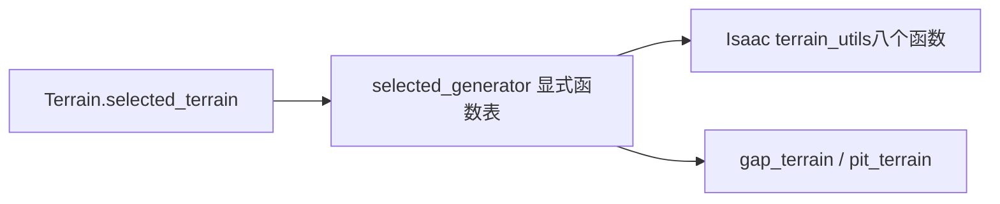

# Isaac地形创建边界

`adapters/isaacgym/terrain_creation.py`公开三个入口：create_ground_plane、
create_heightfield、create_trimesh。它们接收gym/sim句柄、material配置；后两者还接收
terrain数据和device，返回height_samples张量。环境持有返回值，不把整个LeggedRobot
传给适配器。

依赖方向：`envs/base/legged_robot` → `adapters/isaacgym/terrain_creation` → Isaac Gym/Torch。
配置材质与terrain网格参数分开传入，避免把terrain.cfg和env.cfg.terrain混为一谈。
nbRows/nbColumns原有赋值、C顺序flatten、border偏移、height dtype和设备迁移顺序均保留。

验证见`test_terrain_creation_equivalence.py`：使用真实Gym参数类、记录调用的gym替身，
与冻结旧方法逐字段对照三类地形和返回张量，不创建训练环境。

本模块只拥有创建接口。terrain数据生成现在归`adapters/isaacgym/terrain_generation.Terrain`，
依赖Isaac terrain_utils；旧utils/terrain转发已删除。生成算法及NumPy随机调用顺序未变。
机器人actor创建已归下述actor_creation；地形课程更新仍由环境协调现有布局状态。

## 指定地形的公开函数表

`terrain_generation.selected_generator(name)`显式支持8个Isaac terrain_utils生成函数
（random_uniform、sloped、pyramid_sloped、discrete_obstacles、wave、stairs、pyramid_stairs、
stepping_stones，各名带`terrain_utils.`前缀和`_terrain`后缀）及本地gap_terrain/pit_terrain。
函数表替代eval，返回原函数对象，不改生成算法；任意Python表达式不再作为配置接口接受，
未知名报ValueError。新配方只使用列出的名称，不提供隐式动态注册。

当前selected=False为默认配置，仓库没有启用该分支的实验配方。其旧前提仍保留：
cfg.terrain_kwargs须支持pop以及嵌套terrain_kwargs属性，Terrain实例须提供
vertical_scale/horizontal_scale。该分支仍pop掉type字段，不能宣称默认字典就能运行。
本轮只消除动态代码解析，没有修复这些历史配置限制。
test_selected_terrain验证10个函数身份、未知表达式拒绝及实际pit网格/查询顺序。

`adapters/isaacgym/base_task.BaseTask`拥有Gym句柄、设备选择、基础buffer、viewer及
render生命周期。环境继承它实现create_sim/reset_idx/step；旧envs/base/base_task转发已删除。
不应从domain/learning导入这个仿真适配器。Torch JIT开关现由app.torch_runtime显式设置，
TaskRegistry在环境创建前调用；BaseTask不再隐式更改进程级开关。

## Robot资产加载

`adapters/isaacgym/robot_asset.load_robot_asset(gym,sim,asset_cfg,package_root)`
拥有路径格式化、AssetOptions以及资产元信息查询，返回字段明确的LoadedRobotAsset。
不修改URDF，不抽样随机数，不创建actor。dof/shape属性对象原样返回，由调用者按原顺序
随机化；不可偷偷复制或在加载器提前随机化，否则会改变训练分布或RNG顺序。

环境继续按实例顺序执行origin扰动、shape属性、create_actor、dof/body属性及索引绑定。
加载器保留先查询body_count再以len(body_names)覆盖的旧行为。test_robot_asset.py覆盖
选项、查询顺序和返回对象身份；完整生命周期验收仍需真实smoke。

## Actor实例

`actor_creation.create_actor_instances`拥有逐环境的create_env/create_actor与属性写入，
输入包含origin张量、asset句柄/元信息及process_shapes/process_dofs/process_bodies三个回调。
回调由环境提供，允许更新环境随机化buffer；适配器不访问整个环境对象。

每个实例保持原顺序：create_env → XY扰动 → shape回调/写入 → create_actor →
DOF回调/写入 → body读取/回调/写入 → 登记env/actor句柄。
传入的environments/actors列表原地追加，保持回调中可见的历史实例数量。
该模块不批量预采样、不复制属性容器，也不改变recomputeInertia=True。

`dof_properties.read_dof_limits`从资产读取position/velocity/effort并按原算术顺序计算
soft position limits，返回独立张量；环境仍只在env_id=0时初始化这些限制。
`apply_armature`原地修改属性，先清零，再按配置字典顺序匹配关节名，首个命中即停止。
既有命中打印保留。test_dof_properties.py验证非对称范围、字典优先级和未匹配清零。

`body_properties.randomize_body_properties`接收显式domain_rand配置和BodyRandomizationState。
mass/COM张量由任务实例拥有，env0按原顺序生成Torch随机数，随后每个body按NumPy随机数
缩放质量/惯量。函数原地修改Gym属性，环境显式接收更新的mass/com/added_mass引用。
历史base_mass记录在inertia缩放之前，本次保留；不能把诊断记录“修正”混入等价重构。
test_body_properties_equivalence.py覆盖质量/COM/惯量8种组合，比较3个环境的全部属性、
状态张量以及Torch/NumPy RNG状态。

`shape_properties.randomize_shape_properties`负责摩擦与restitution，显式接收
ShapeRandomizationState。env0先在CPU抽取bucket_ids，再按原device生成64个摩擦bucket，
随后抽取restitution；此顺序及friction系数的二维形状保留。每环境的所有shape使用同一系数。
test_shape_properties_equivalence.py覆盖四种开关组合，核对属性、返回对象、buffer和RNG。

## 高度采样

domain.geometry.height_sampling.sample_heights显式接收地形网格、root/quaternion和采样点，
只计算张量，不引用Gym。环境负责选择输入。坐标yaw旋转、边界clamp、三个网格点取min、
最终reshape和scale顺序与旧实现相同。
历史env_ids使用truth-value判断，多元素Tensor会报错；子集输出仍按总num_envs reshape。
这两个旧边界没有借重构修正，test_height_sampling_equivalence.py也验证错误保持一致。
需要改变子集API时应单独设计，不把它混入等价迁移。
