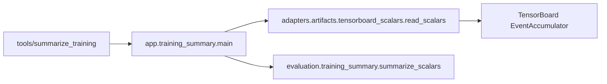

# 训练日志摘要

`tools/summarize_training.py RUN --window 50`仅打印现有TensorBoard标量摘要，不启动训练。

读取适配器只返回指定tag的有序(step,value)列表，保持size_guidance scalars=0、不额外排序。
evaluation定义9个历史指标的顺序，计算末值及尾部平均值，按6位小数输出；不依赖TensorBoard。
CLI仍接受相对run路径、同名window参数和默认50，JSON结构不变。

原有边界行为保留：缺失tag省略；window=0读取全部，负值按Python切片语义处理；
存在但无样本的tag会抛IndexError。没有借重构添加参数限制或吞掉数据错误。
导入模块不解析参数、不读取event。输出是训练诊断，不能证明策略通过运动验收。

实际既有event文件输出与提取前逐字节一致，证据为
`plane/outputs/architecture_refactor_20260923/training_summary_equivalence.json`。
