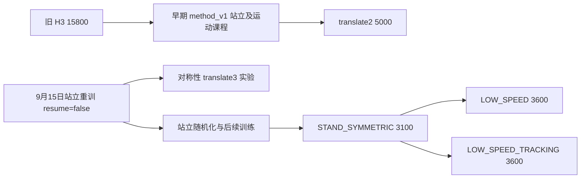

# 新旧策略统一验收

模型选择、完整 run 清单和继承关系见 [模型分支索引](model_branches.md)。
本次 [240 项精简指标](data/policy_comparison_20260919.csv) 与
[模型哈希/验收协议](data/policy_comparison_20260919.json) 纳入 Git，完整原始结果仍保留于 outputs。

目标：比较历史运动策略、早期 method_v1 运动策略，以及最新站立转运动策略，
为选择训练起点提供证据。课程名或训练命令上限不等于通过独立验收。
这是有限候选比较，不是重构各项改动的因果消融，也不是全量 checkpoint 搜索。

## 运行与恢复

仓库根目录运行：

```bash
/home/kellen/anaconda3/envs/fudan_leg/bin/python tools/compare_policy_versions.py
```

脚本仅评估，不启动训练。每次建立独立 `plane/outputs/policy_comparison_<timestamp>`。
使用 GPU 0、fudan_leg、headless。每份原始 JSON、stdout、模型 SHA256、源 manifest、
实际环境配置均保留。单个命令组作为一批环境同时测量，以减少重复启动。

中断后先检查 `status.json` 的 supervisor/child PID；没有正在运行的同一任务才恢复：

```bash
/home/kellen/anaconda3/envs/fudan_leg/bin/python tools/compare_policy_versions.py \
  --job plane/outputs/policy_comparison_<timestamp>
```

文件锁阻止同一任务重复 supervisor；已完成 JSON 校验哈希后复用。
代码、模型或资产改变应建立新任务，不混用旧结果。强制杀死 supervisor 时可能留下子进程，
必须先核查，不能仅凭 `status.json` 判断其存活。

汇总（允许在运行途中执行，此时报告明确标记未完成）：

```bash
/home/kellen/anaconda3/envs/fudan_leg/bin/python tools/summarize_policy_comparison.py \
  plane/outputs/policy_comparison_<timestamp>
```

输出 `comparison.csv`、`comparison.md`、`matching_check.json`。
汇总器检查不同 checkpoint 在相同 seed/命令组下的初始 root state、observation、
控制及环境配置完全相同；出现不一致直接报错。

## 固定条件与门槛

- 统一当前 URDF、混合 PD、25/125/6 policy contract，物理 200 Hz、policy 100 Hz。
- deterministic actor mean，无 observation noise、无推扰；只推理 actor/encoder。
- 所有模型采用同一当前接触终止条件，不回放各历史版本的 reward/termination。
- 参数随机化 level 0 与 level 1 分开评估。两者都保留环境原有的随机初始速度。
- seeds 19/37/53，每命令 16 env，每组 25 秒、前 5 秒 warmup。
- 初始命令 `0、−0.5、+0.5、−1、+1 m/s`，yaw=0、height=0.40 m。
- 每个 seed、每个命令独立过关，不能以跨 seed 平均值掩盖失败。
- vx MAE：零命令 ≤0.05，运动 ≤0.10 m/s；绝对 yaw 均值 ≤0.10 rad/s。
- height MAE ≤0.03 m，每轮接触率 ≥0.99，测量段无非轮接触，全程无 failure/timeout。
- preclip torque saturation ≤1%。这是本次明确采用的操作门槛，不宣称是历史 gate。
- 几何误差、roll/pitch、slip、encoder 误差和逐环境指标作为诊断。
- 初始组全部通过才测 `0、±2`，再全部通过才测 `0、±3`，各随机化条件分别判定。

门槛使用平均绝对误差，避免正负偏差抵消；全部重置计数包含 warmup。
若发生重置，汇总轨迹含重置后的样本，不能用这些均值宣布成功；gate 会拒绝。
力矩计数在重置时清零，该情况下力矩统计也标记为无效。

本次没有测 yaw command、响应延迟、反向切换、顺滑转弯、ONNX 或闭链 sim2sim。
同一当前环境的比较不等价于每个旧版本的完整运行时复现。

## 2026-09-19 执行记录

任务目录：`plane/outputs/policy_comparison_20260919_004138`。
候选及选择依据见该目录 `manifest.json`，实际终态以 `status.json` 为准。
8 个候选涵盖 H3、两条 H7、早期 method_v1 ±2、后期对称性 ±3、站立、两条低速。
H7 在各自 run 内按存档 event 的 survival、zero、forward/reverse/yaw 综合指标筛选，
避免直接采用退化末尾；此筛选不代表已找到全仓库最优模型。

实现验证：10 环境、2 秒物理 smoke 已通过；验收 gate 的四项回归测试通过。
正式评估已完成 48 组（8 checkpoint × 2 随机化条件 × 3 seed），共 240 个
命令/seed 条目，每条 16 env。进程正常退出；48 组匹配检查无不一致。
8 个候选在两种条件下均未通过完整初始门槛，因此没有执行 ±2、±3 测试。
这不证明其高速一定失败，只表示本次未建立允许升速的前提。

## 结果与路线决定

推荐下一轮运动训练起点（候选，不是已通过验收的模型）：

```text
plane/logs/wheel_legged/Sep05_17-41-43_H3_from_H2_best_v1/model_15800.pt
```

level 1 随机化、三种子平均结果：

| 候选 | 四个运动命令平均 vx MAE (m/s) | 零命令 vx MAE (m/s) | 通过条目 / 15 | 失败重置次数 |
|---|---:|---:|---:|---:|
| H3 15800 | 0.1007 | 0.0068 | 9 | 0 |
| H7 fixed 16200 | 0.1139 | 0.0058 | 6 | 0 |
| H7 bounded 17700 | 0.1526 | 0.0174 | 3 | 0 |
| method_v1 translate2 5000 | 0.2378 | 0.0657 | 5 | 5 |
| method_v1 translate3 symmetry 1500 | 0.5648 | 0.0337 | 3 | 0 |
| STAND_SYMMETRIC 3100 | 0.2798 | 0.0189 | 7 | 1136 |
| LOW_SPEED 3600 | 0.4301 | 0.1261 | 0 | 0 |
| LOW_SPEED_TRACKING 3600 | 0.4046 | 0.2009 | 0 | 14 |

“失败重置次数”可包含同一环境多次重置，不是失败环境数。站立基线的失败都发生在
±1 m/s，本结果不否定之前的零命令站立/小推扰验收。带重置的均值不能作为成功证据。
四个运动命令为 ±0.5、±1，均值仅描述总体表现；gate 逐 seed、逐命令判定。

| 命令 vx (m/s) | H3 实际 vx | LOW_SPEED 实际 vx | LOW_SPEED_TRACKING 实际 vx |
|---|---:|---:|---:|
| 0 | -0.0068 | +0.1261 | +0.2009 |
| -0.5 | -0.4032 | -0.0668 | +0.0045 |
| +0.5 | +0.3799 | +0.2949 | +0.3817 |
| -1 | -0.8686 | -0.4118 | -0.4366 |
| +1 | +0.9456 | +0.5062 | +0.5710 |

在 +0.5 命令下，H3 / LOW_SPEED / LOW_SPEED_TRACKING 的绝对 yaw 均值分别为
0.0287 / 0.1703 / 0.2909 rad/s。新版 tracking 分支前进均速接近 H3，但偏航、
停车和后退明显更差，不能认为整体改善。

H3 的明确短板是 +0.5 的 MAE 0.1201、-1 的 MAE 0.1314，均超过 0.10 门槛。
零命令时 H3 轮心镜像误差 2.6 mm，当前站立基线 22.5 mm；新站立奖励在其分支
上的局部收益不能推广成“比旧 H3 更对称”。本次没有做匹配推扰测试，不比较抗推扰能力。

### 版本与权重继承

源 manifest 证明后期站立分支由 `resume=false` 重训产生，没有继承早期 ±2 运动权重。
来源记录保存为任务目录的 `lineage.json`。



因此，本次证据支持“保留新的验收/诊断框架，重新选择运动权重起点”。它不构成
某个 reward、critic 或 optimizer 改动导致退化的因果证明。

### 下一轮实验边界

1. 保留 H3 15800 为推荐运动迁移候选，站立 3100 为独立站立参考；均不覆盖。
2. 不继续延长本次两条失败低速 run，不恢复 ±3/±4 课程。
3. 仍从 ±0.5 的停车/正反向/直行验收入手，优先修正 H3 的跟踪偏差，保留已有运动能力。
4. 如把 H3 迁入 normalized_v1，单独定义迁移实验：actor/encoder 可初始化，旧 reward
   的 critic/Adam 不作同语义完整续训。std/噪声初始化必须明确记录，不能静默重置。
   当前 LOW_SPEED 入口要求兼容源的 full warm start，不能直接套用到 H3 或删除该安全检查。
5. 要归因于“权重起点”，应让 H3 源与站立源采用相同的新 critic/optimizer、采样、
   reward 和噪声设置，只改变 actor/encoder 起点；先 1 iteration smoke，再各 500
   iteration，按同一独立验收比较，禁止用命令补偿修饰结果。

本轮完成比较与路线选择，没有更改 reward/PPO/课程，也没有启动新训练。

完整数据：任务目录下 `comparison.md`、`comparison.csv`、`summary.json`、各 grid JSON。
存档配置字面值对照见 `archived_contract_comparison.json`；观测/history/reset 函数
AST 对照见 `archived_observation_reset_comparison.json`，8 个候选均与当前实现一致。
12 个关键源码快照及哈希保存在 `source_snapshot/`、`source_snapshot_sha256.json`。
